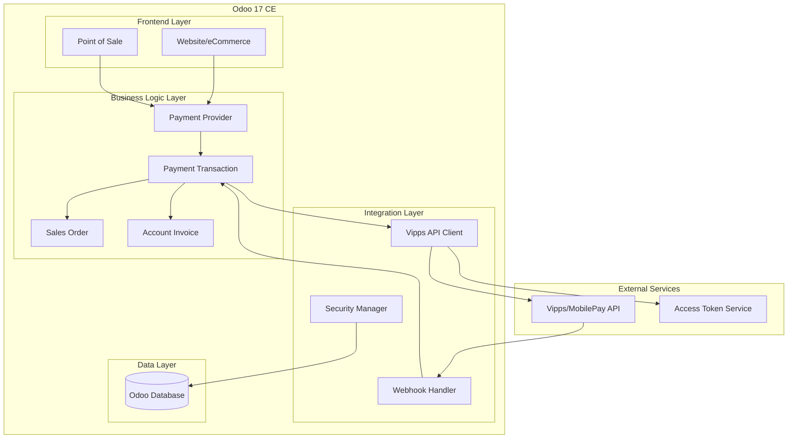

# Design Document

## Overview

The Vipps/MobilePay integration for Odoo 17 CE will be implemented as a comprehensive payment provider module that extends Odoo's existing payment infrastructure. The solution provides seamless payment processing for both online ecommerce and Point of Sale scenarios while maintaining strict security standards and legal compliance for Nordic markets.

The integration leverages the Vipps/MobilePay ePayment API v1.7.0 and follows Odoo's standard payment provider architecture, ensuring compatibility with existing workflows while adding Nordic-specific payment capabilities.

## Architecture

### High-Level Architecture



### Module Structure

```
mobilepay_vipps/
├── __init__.py
├── __manifest__.py
├── controllers/
│   ├── __init__.py
│   └── main.py                 # Webhook and return URL handlers
├── models/
│   ├── __init__.py
│   ├── payment_provider.py     # Provider configuration
│   ├── payment_transaction.py  # Transaction handling
│   └── vipps_api_client.py    # API communication layer
├── static/
│   ├── description/
│   └── src/
│       └── js/
│           └── payment_form.js # Frontend payment handling
├── views/
│   ├── payment_provider_views.xml
│   └── payment_transaction_views.xml
├── data/
│   └── payment_provider_data.xml
├── security/
│   └── ir.model.access.csv
└── tests/
    ├── __init__.py
    └── test_payment_vipps.py
```

## Components and Interfaces

### 1. Payment Provider Model (`payment.provider`)

**Purpose:** Extends Odoo's payment provider to add Vipps/MobilePay specific configuration.

**Key Fields:**
- `code`: Selection field with 'vipps' option
- `vipps_merchant_serial_number`: MSN for API authentication
- `vipps_subscription_key`: Ocp-Apim-Subscription-Key for API access
- `vipps_client_id`: Client ID for access token generation
- `vipps_client_secret`: Encrypted client secret
- `vipps_environment`: Selection between 'test' and 'production'
- `vipps_capture_mode`: Selection between 'manual' and 'automatic'
- `vipps_collect_user_info`: Boolean for profile data collection
- `vipps_webhook_secret`: Secret for webhook validation

**Key Methods:**
- `_get_vipps_api_url()`: Returns appropriate API base URL
- `_get_access_token()`: Manages access token lifecycle
- `_validate_vipps_credentials()`: Validates API credentials
- `_get_supported_currencies()`: Returns NOK, DKK, EUR

### 2. Payment Transaction Model (`payment.transaction`)

**Purpose:** Handles individual payment transactions and API communication.

**Key Fields:**
- `vipps_payment_reference`: Unique payment reference
- `vipps_psp_reference`: PSP reference from Vipps
- `vipps_idempotency_key`: Idempotency key for API calls
- `vipps_payment_state`: Current payment state (CREATED, AUTHORIZED, etc.)
- `vipps_user_flow`: Flow type (WEB_REDIRECT, QR, PUSH_MESSAGE)
- `vipps_qr_code`: Base64 encoded QR code for POS
- `vipps_redirect_url`: URL for customer redirection

**Key Methods:**
- `_send_payment_request()`: Creates payment via API
- `_get_payment_status()`: Polls payment status
- `_capture_payment()`: Captures authorized payment
- `_refund_payment()`: Processes refunds
- `_cancel_payment()`: Cancels unauthorized payments
- `_handle_webhook()`: Processes webhook notifications

### 3. Vipps API Client (`vipps.api.client`)

**Purpose:** Centralized API communication with security and error handling.

**Key Methods:**
- `create_payment(payload)`: POST /v1/payments
- `get_payment(reference)`: GET /v1/payments/{reference}
- `capture_payment(reference, amount)`: POST /v1/payments/{reference}/capture
- `refund_payment(reference, amount)`: POST /v1/payments/{reference}/refund
- `cancel_payment(reference)`: POST /v1/payments/{reference}/cancel
- `get_access_token()`: Fetches and caches access tokens
- `validate_webhook(payload, signature)`: Validates webhook authenticity

**Security Features:**
- Automatic token refresh with exponential backoff
- Request signing and validation
- Encrypted credential storage
- Comprehensive audit logging
- Rate limiting and retry logic

### 4. Webhook Controller (`controllers.main`)

**Purpose:** Handles incoming webhooks from Vipps/MobilePay.

**Endpoints:**
- `/payment/vipps/webhook`: Receives payment status updates
- `/payment/vipps/return`: Handles customer returns from payment flow

**Security Measures:**
- Webhook signature validation
- Idempotency handling
- IP whitelist validation
- Request rate limiting

### 5. POS Integration

**Purpose:** Extends POS interface for in-store payments.

**Components:**
- POS payment method registration
- QR code display widget
- Phone number input interface
- Real-time status polling
- Receipt integration

**User Flows:**
1. **QR Code Flow**: Display QR for customer scanning
2. **Phone Number Flow**: Send push notification to customer's app

## Data Models

### Payment Provider Configuration

```python
class PaymentProvider(models.Model):
    _inherit = 'payment.provider'
    
    # Core Configuration
    code = fields.Selection(selection_add=[('vipps', 'Vipps/MobilePay')])
    vipps_merchant_serial_number = fields.Char(required_if_provider='vipps')
    vipps_subscription_key = fields.Char(required_if_provider='vipps')
    vipps_client_id = fields.Char(required_if_provider='vipps')
    vipps_client_secret = fields.Char(required_if_provider='vipps')
    
    # Environment Configuration
    vipps_environment = fields.Selection([
        ('test', 'Test Environment'),
        ('production', 'Production Environment')
    ], default='test', required_if_provider='vipps')
    
    # Feature Configuration
    vipps_capture_mode = fields.Selection([
        ('manual', 'Manual Capture (Recommended for eCommerce)'),
        ('automatic', 'Automatic Capture (POS Only)')
    ], default='manual', required_if_provider='vipps')
    
    vipps_collect_user_info = fields.Boolean(
        string="Collect User Information",
        help="Collect customer name, email, and phone number during payment"
    )
    
    # Security Configuration
    vipps_webhook_secret = fields.Char(groups='base.group_system')
    vipps_access_token = fields.Text(groups='base.group_system')
    vipps_token_expires_at = fields.Datetime(groups='base.group_system')
```

### Payment Transaction Extensions

```python
class PaymentTransaction(models.Model):
    _inherit = 'payment.transaction'
    
    # Vipps-specific fields
    vipps_payment_reference = fields.Char(index=True)
    vipps_psp_reference = fields.Char()
    vipps_idempotency_key = fields.Char()
    vipps_payment_state = fields.Selection([
        ('CREATED', 'Created'),
        ('AUTHORIZED', 'Authorized'),
        ('CAPTURED', 'Captured'),
        ('CANCELLED', 'Cancelled'),
        ('REFUNDED', 'Refunded'),
        ('EXPIRED', 'Expired'),
        ('ABORTED', 'Aborted'),
        ('TERMINATED', 'Terminated')
    ])
    
    # Flow-specific fields
    vipps_user_flow = fields.Selection([
        ('WEB_REDIRECT', 'Web Redirect'),
        ('QR', 'QR Code'),
        ('PUSH_MESSAGE', 'Push Message')
    ])
    
    vipps_qr_code = fields.Text()  # Base64 encoded QR code
    vipps_redirect_url = fields.Char()
    vipps_customer_phone = fields.Char()  # For POS push messages
    
    # User information (if collected)
    vipps_user_sub = fields.Char()  # For userinfo API calls
    vipps_user_details = fields.Text()  # JSON stored user details
```

## Error Handling

### Error Classification

1. **Authentication Errors (401/403)**
   - Invalid credentials
   - Expired access tokens
   - Insufficient permissions

2. **Validation Errors (400)**
   - Invalid payment amounts
   - Malformed requests
   - Missing required fields

3. **Business Logic Errors (409)**
   - Payment already captured
   - Insufficient funds
   - Payment expired

4. **System Errors (500)**
   - API service unavailable
   - Network timeouts
   - Internal server errors

### Error Handling Strategy

```python
class VippsAPIException(Exception):
    def __init__(self, message, error_code=None, trace_id=None):
        self.message = message
        self.error_code = error_code
        self.trace_id = trace_id
        super().__init__(message)

def handle_api_error(response):
    if response.status_code == 401:
        # Trigger token refresh
        raise VippsAPIException("Authentication failed", "AUTH_ERROR")
    elif response.status_code == 400:
        # Log validation error and notify user
        error_data = response.json()
        raise VippsAPIException(
            error_data.get('detail', 'Validation error'),
            error_data.get('type'),
            error_data.get('traceId')
        )
    # ... handle other error types
```

### Retry Logic

- **Exponential Backoff**: For transient errors (5xx, network timeouts)
- **Circuit Breaker**: Disable payment method after consecutive failures
- **Graceful Degradation**: Fall back to alternative payment methods

## Testing Strategy

### Unit Tests

1. **API Client Tests**
   - Mock API responses for all endpoints
   - Test error handling and retry logic
   - Validate request formatting and headers

2. **Model Tests**
   - Test payment flow state transitions
   - Validate field constraints and computations
   - Test security and access controls

3. **Integration Tests**
   - Test webhook processing
   - Validate eCommerce checkout flow
   - Test POS payment scenarios

### Test Data Management

```python
class TestVippsPayment(TransactionCase):
    def setUp(self):
        super().setUp()
        self.provider = self.env['payment.provider'].create({
            'name': 'Vipps Test',
            'code': 'vipps',
            'state': 'test',
            'vipps_merchant_serial_number': '123456',
            'vipps_subscription_key': 'test_key',
            'vipps_environment': 'test'
        })
    
    @patch('requests.post')
    def test_create_payment_success(self, mock_post):
        # Mock successful API response
        mock_post.return_value.json.return_value = {
            'reference': 'test-ref-123',
            'redirectUrl': 'https://test.vipps.no/redirect'
        }
        
        # Test payment creation
        transaction = self._create_test_transaction()
        result = transaction._send_payment_request()
        
        self.assertEqual(result['type'], 'ir.actions.act_url')
        self.assertIn('vipps.no', result['url'])
```

### Security Testing

1. **Webhook Security**
   - Test signature validation
   - Test replay attack prevention
   - Validate IP restrictions

2. **Data Protection**
   - Test credential encryption
   - Validate PII handling
   - Test audit logging

3. **Access Control**
   - Test user permissions
   - Validate admin-only fields
   - Test multi-company isolation

### Performance Testing

1. **Load Testing**
   - Concurrent payment processing
   - Webhook handling under load
   - Database performance with high transaction volume

2. **API Rate Limiting**
   - Test rate limit handling
   - Validate backoff strategies
   - Test circuit breaker functionality

## Security Considerations

### Data Encryption

- **At Rest**: All sensitive configuration data encrypted using Odoo's encryption
- **In Transit**: All API communications use TLS 1.2+
- **Key Management**: Secure storage and rotation of API credentials

### Authentication & Authorization

- **API Authentication**: Bearer token with automatic refresh
- **Webhook Validation**: HMAC signature verification
- **User Permissions**: Role-based access to payment functions

### Compliance

- **PCI DSS**: No card data storage, tokenization for references
- **GDPR**: User consent for data collection, data retention policies
- **Audit Trail**: Comprehensive logging of all payment operations

### Security Headers

```python
def _get_api_headers(self):
    return {
        'Authorization': f'Bearer {self._get_access_token()}',
        'Ocp-Apim-Subscription-Key': self.vipps_subscription_key,
        'Merchant-Serial-Number': self.vipps_merchant_serial_number,
        'Vipps-System-Name': 'Odoo',
        'Vipps-System-Version': '17.0',
        'Vipps-System-Plugin-Name': 'mobilepay-vipps',
        'Vipps-System-Plugin-Version': '1.0.0',
        'Idempotency-Key': str(uuid.uuid4()),
        'Content-Type': 'application/json'
    }
```

## Integration Points

### Odoo Core Modules

1. **Sales (`sale`)**
   - Payment provider selection in sales orders
   - Automatic capture on delivery confirmation
   - Order status synchronization

2. **Point of Sale (`point_of_sale`)**
   - Payment method registration
   - Real-time payment processing
   - Receipt integration

3. **Accounting (`account`)**
   - Journal entry creation
   - Payment reconciliation
   - Refund processing

4. **eCommerce (`website_sale`)**
   - Checkout payment option
   - Customer return handling
   - Order confirmation flow

### External Integrations

1. **Vipps/MobilePay API**
   - Payment lifecycle management
   - Webhook notifications
   - User information collection

2. **Access Token Service**
   - Authentication token management
   - Automatic token refresh
   - Credential validation

## Deployment Considerations

### Environment Configuration

- **Test Environment**: Uses `apitest.vipps.no` endpoints
- **Production Environment**: Uses `api.vipps.no` endpoints
- **Credential Management**: Separate credentials per environment

### Monitoring & Alerting

- **API Health Monitoring**: Regular health checks and uptime monitoring
- **Error Rate Tracking**: Alert on elevated error rates
- **Performance Metrics**: Response time and throughput monitoring

### Backup & Recovery

- **Configuration Backup**: Secure backup of provider settings
- **Transaction Logging**: Comprehensive audit trail for recovery
- **Disaster Recovery**: Procedures for service restoration