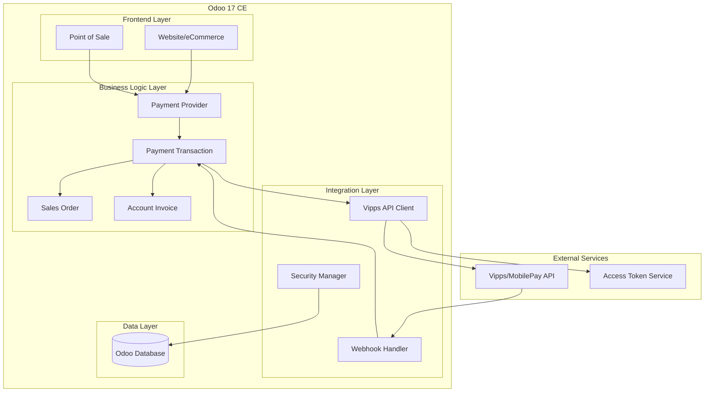

# Design Document

## Overview

The Vipps/MobilePay integration for Odoo 17 CE will be implemented as a comprehensive payment provider module that extends Odoo's existing payment infrastructure. The solution provides seamless payment processing for both online ecommerce and Point of Sale scenarios while maintaining strict security standards and legal compliance for Nordic markets.

The integration leverages the Vipps/MobilePay ePayment API v1.7.0 and follows Odoo's standard payment provider architecture, ensuring compatibility with existing workflows while adding Nordic-specific payment capabilities.

## Architecture

### High-Level Architecture



### Module Structure

```
mobilepay_vipps/
├── __init__.py
├── __manifest__.py
├── controllers/
│   ├── __init__.py
│   └── main.py                 # Webhook and return URL handlers
├── models/
│   ├── __init__.py
│   ├── payment_provider.py     # Provider configuration
│   ├── payment_transaction.py  # Transaction handling
│   └── vipps_api_client.py    # API communication layer
├── wizard/
│   ├── __init__.py
│   └── vipps_onboarding.py    # Setup wizard for initial configuration
├── static/
│   ├── description/
│   └── src/
│       └── js/
│           └── payment_form.js # Frontend payment handling
├── views/
│   ├── payment_provider_views.xml
│   ├── payment_transaction_views.xml
│   └── vipps_onboarding_views.xml
├── data/
│   ├── payment_provider_data.xml
│   └── vipps_onboarding_data.xml
├── security/
│   └── ir.model.access.csv
└── tests/
    ├── __init__.py
    └── test_payment_vipps.py
```

## Components and Interfaces

### 1. Payment Provider Model (`payment.provider`)

**Purpose:** Extends Odoo's payment provider to add Vipps/MobilePay specific configuration.

**Key Fields:**
- `code`: Selection field with 'vipps' option
- `vipps_merchant_serial_number`: MSN for API authentication
- `vipps_subscription_key`: Ocp-Apim-Subscription-Key for API access
- `vipps_client_id`: Client ID for access token generation
- `vipps_client_secret`: Encrypted client secret
- `vipps_environment`: Selection between 'test' and 'production'
- `vipps_capture_mode`: Selection between 'manual' and 'automatic'
- `vipps_collect_user_info`: Boolean for profile data collection
- `vipps_webhook_secret`: Secret for webhook validation

**Key Methods:**
- `_get_vipps_api_url()`: Returns appropriate API base URL
- `_get_access_token()`: Manages access token lifecycle
- `_validate_vipps_credentials()`: Validates API credentials
- `_get_supported_currencies()`: Returns NOK, DKK, EUR

### 2. Payment Transaction Model (`payment.transaction`)

**Purpose:** Handles individual payment transactions and API communication.

**Key Fields:**
- `vipps_payment_reference`: Unique payment reference
- `vipps_psp_reference`: PSP reference from Vipps
- `vipps_idempotency_key`: Idempotency key for API calls
- `vipps_payment_state`: Current payment state (CREATED, AUTHORIZED, etc.)
- `vipps_user_flow`: Flow type (WEB_REDIRECT, QR, PUSH_MESSAGE)
- `vipps_qr_code`: Base64 encoded QR code for POS
- `vipps_redirect_url`: URL for customer redirection

**Key Methods:**
- `_send_payment_request()`: Creates payment via API
- `_send_pos_payment_request()`: Creates POS payment with specific method
- `_create_shop_initiated_payment()`: Handles shop number/QR payments
- `_get_payment_status()`: Polls payment status
- `_capture_payment()`: Captures authorized payment
- `_refund_payment()`: Processes refunds
- `_cancel_payment()`: Cancels unauthorized payments
- `_handle_webhook()`: Processes webhook notifications

**POS-Specific Methods:**
- `_create_customer_qr_payment()`: Generate QR for customer scanning
- `_create_customer_phone_payment()`: Send push to customer phone
- `_initiate_manual_shop_number_payment()`: Display shop number for customer to enter manually
- `_initiate_manual_shop_qr_payment()`: Display shop QR for customer to scan manually
- `_verify_manual_payment()`: Cashier verification of customer's phone transaction

### 3. Vipps API Client (`vipps.api.client`)

**Purpose:** Centralized API communication with security and error handling.

**Key Methods:**
- `create_payment(payload)`: POST /v1/payments
- `get_payment(reference)`: GET /v1/payments/{reference}
- `capture_payment(reference, amount)`: POST /v1/payments/{reference}/capture
- `refund_payment(reference, amount)`: POST /v1/payments/{reference}/refund
- `cancel_payment(reference)`: POST /v1/payments/{reference}/cancel
- `get_access_token()`: Fetches and caches access tokens
- `validate_webhook(payload, signature)`: Validates webhook authenticity

**Security Features:**
- Automatic token refresh with exponential backoff
- Request signing and validation
- Encrypted credential storage
- Comprehensive audit logging
- Rate limiting and retry logic

### 4. Webhook Controller (`controllers.main`)

**Purpose:** Handles incoming webhooks from Vipps/MobilePay.

**Endpoints:**
- `/payment/vipps/webhook`: Receives payment status updates
- `/payment/vipps/return`: Handles customer returns from payment flow

**Security Measures:**
- Webhook signature validation
- Idempotency handling
- IP whitelist validation
- Request rate limiting

### 5. POS Integration

**Purpose:** Extends POS interface for in-store payments with multiple payment initiation methods.

**Components:**
- POS payment method registration
- QR code display widget
- Phone number input interface
- Shop MobilePay number/QR input interface
- Real-time status polling
- Receipt integration

**User Flows:**
1. **Customer QR Code Flow**: Display QR for customer scanning
2. **Customer Phone Number Flow**: Send push notification to customer's app
3. **Manual Shop Number Flow**: Customer manually enters shop's MobilePay number and amount in their app, cashier verifies transaction on customer's phone
4. **Manual Shop QR Flow**: Customer manually scans shop's QR code in their app and enters amount, cashier verifies transaction on customer's phone

**POS Interface Design:**

```javascript
// POS Payment Method Selection
const VippsPaymentMethods = {
    CUSTOMER_QR: 'customer_qr',           // Generate QR for customer
    CUSTOMER_PHONE: 'customer_phone',     // Send push to customer phone
    MANUAL_SHOP_NUMBER: 'manual_shop_number', // Customer enters shop number manually
    MANUAL_SHOP_QR: 'manual_shop_qr'     // Customer scans shop QR manually
};

// POS Widget Components
class VippsPOSWidget extends PaymentInterface {
    init() {
        this.paymentMethod = null;
        this.setupPaymentMethodSelector();
    }
    
    setupPaymentMethodSelector() {
        // Radio buttons for payment method selection
        // Dynamic form fields based on selection
    }
    
    renderCustomerQRFlow() {
        // Display generated QR code for customer scanning
    }
    
    renderCustomerPhoneFlow() {
        // Input field for customer phone number
    }
    
    renderManualShopNumberFlow() {
        // Display shop MobilePay number for customer to enter manually
        // Show instructions: "Ask customer to open MobilePay app and enter this number"
        // Verification button for cashier to check customer's phone
    }
    
    renderManualShopQRFlow() {
        // Display shop QR code for customer to scan manually
        // Show instructions: "Ask customer to scan this QR code with MobilePay app"
        // Verification button for cashier to check customer's phone
    }
    
    verifyManualPayment() {
        // Interface for cashier to verify transaction on customer's phone
        // Confirm amount and transaction details match
    }
}
```

## Data Models

### Payment Provider Configuration

```python
class PaymentProvider(models.Model):
    _inherit = 'payment.provider'
    
    # Core Configuration
    code = fields.Selection(selection_add=[('vipps', 'Vipps/MobilePay')])
    vipps_merchant_serial_number = fields.Char(required_if_provider='vipps')
    vipps_subscription_key = fields.Char(required_if_provider='vipps')
    vipps_client_id = fields.Char(required_if_provider='vipps')
    vipps_client_secret = fields.Char(required_if_provider='vipps')
    
    # Environment Configuration
    vipps_environment = fields.Selection([
        ('test', 'Test Environment'),
        ('production', 'Production Environment')
    ], default='test', required_if_provider='vipps')
    
    # Feature Configuration
    vipps_capture_mode = fields.Selection([
        ('manual', 'Manual Capture (Recommended for eCommerce)'),
        ('automatic', 'Automatic Capture (POS Only)')
    ], default='manual', required_if_provider='vipps')
    
    vipps_collect_user_info = fields.Boolean(
        string="Collect User Information",
        help="Collect customer name, email, and phone number during payment"
    )
    
    # Security Configuration
    vipps_webhook_secret = fields.Char(groups='base.group_system')
    vipps_access_token = fields.Text(groups='base.group_system')
    vipps_token_expires_at = fields.Datetime(groups='base.group_system')
```

### Payment Transaction Extensions

```python
class PaymentTransaction(models.Model):
    _inherit = 'payment.transaction'
    
    # Vipps-specific fields
    vipps_payment_reference = fields.Char(index=True)
    vipps_psp_reference = fields.Char()
    vipps_idempotency_key = fields.Char()
    vipps_payment_state = fields.Selection([
        ('CREATED', 'Created'),
        ('AUTHORIZED', 'Authorized'),
        ('CAPTURED', 'Captured'),
        ('CANCELLED', 'Cancelled'),
        ('REFUNDED', 'Refunded'),
        ('EXPIRED', 'Expired'),
        ('ABORTED', 'Aborted'),
        ('TERMINATED', 'Terminated')
    ])
    
    # Flow-specific fields
    vipps_user_flow = fields.Selection([
        ('WEB_REDIRECT', 'Web Redirect'),
        ('QR', 'QR Code'),
        ('PUSH_MESSAGE', 'Push Message')
    ])
    
    # POS payment method type
    vipps_pos_method = fields.Selection([
        ('customer_qr', 'Customer QR Code'),
        ('customer_phone', 'Customer Phone Number'),
        ('manual_shop_number', 'Manual Shop Number Entry'),
        ('manual_shop_qr', 'Manual Shop QR Scan')
    ])
    
    vipps_qr_code = fields.Text()  # Base64 encoded QR code
    vipps_redirect_url = fields.Char()
    vipps_customer_phone = fields.Char()  # For customer push messages
    
    # Manual payment verification fields
    vipps_shop_mobilepay_number = fields.Char()  # Shop's MobilePay number for customer reference
    vipps_expected_amount = fields.Monetary()  # Expected amount for verification
    vipps_manual_verification_status = fields.Selection([
        ('pending', 'Pending Customer Action'),
        ('verified', 'Verified by Cashier'),
        ('failed', 'Verification Failed')
    ])  # Status of manual verification process
    
    # User information (if collected)
    vipps_user_sub = fields.Char()  # For userinfo API calls
    vipps_user_details = fields.Text()  # JSON stored user details
```

## Error Handling

### Error Classification

1. **Authentication Errors (401/403)**
   - Invalid credentials
   - Expired access tokens
   - Insufficient permissions

2. **Validation Errors (400)**
   - Invalid payment amounts
   - Malformed requests
   - Missing required fields

3. **Business Logic Errors (409)**
   - Payment already captured
   - Insufficient funds
   - Payment expired

4. **System Errors (500)**
   - API service unavailable
   - Network timeouts
   - Internal server errors

### Error Handling Strategy

```python
class VippsAPIException(Exception):
    def __init__(self, message, error_code=None, trace_id=None):
        self.message = message
        self.error_code = error_code
        self.trace_id = trace_id
        super().__init__(message)

def handle_api_error(response):
    if response.status_code == 401:
        # Trigger token refresh
        raise VippsAPIException("Authentication failed", "AUTH_ERROR")
    elif response.status_code == 400:
        # Log validation error and notify user
        error_data = response.json()
        raise VippsAPIException(
            error_data.get('detail', 'Validation error'),
            error_data.get('type'),
            error_data.get('traceId')
        )
    # ... handle other error types
```

### Retry Logic

- **Exponential Backoff**: For transient errors (5xx, network timeouts)
- **Circuit Breaker**: Disable payment method after consecutive failures
- **Graceful Degradation**: Fall back to alternative payment methods

## Testing Strategy

### Unit Tests

1. **API Client Tests**
   - Mock API responses for all endpoints
   - Test error handling and retry logic
   - Validate request formatting and headers

2. **Model Tests**
   - Test payment flow state transitions
   - Validate field constraints and computations
   - Test security and access controls

3. **Integration Tests**
   - Test webhook processing
   - Validate eCommerce checkout flow
   - Test POS payment scenarios

### Test Data Management

```python
class TestVippsPayment(TransactionCase):
    def setUp(self):
        super().setUp()
        self.provider = self.env['payment.provider'].create({
            'name': 'Vipps Test',
            'code': 'vipps',
            'state': 'test',
            'vipps_merchant_serial_number': '123456',
            'vipps_subscription_key': 'test_key',
            'vipps_environment': 'test'
        })
    
    @patch('requests.post')
    def test_create_payment_success(self, mock_post):
        # Mock successful API response
        mock_post.return_value.json.return_value = {
            'reference': 'test-ref-123',
            'redirectUrl': 'https://test.vipps.no/redirect'
        }
        
        # Test payment creation
        transaction = self._create_test_transaction()
        result = transaction._send_payment_request()
        
        self.assertEqual(result['type'], 'ir.actions.act_url')
        self.assertIn('vipps.no', result['url'])
```

### Security Testing

1. **Webhook Security**
   - Test signature validation
   - Test replay attack prevention
   - Validate IP restrictions

2. **Data Protection**
   - Test credential encryption
   - Validate PII handling
   - Test audit logging

3. **Access Control**
   - Test user permissions
   - Validate admin-only fields
   - Test multi-company isolation

### Performance Testing

1. **Load Testing**
   - Concurrent payment processing
   - Webhook handling under load
   - Database performance with high transaction volume

2. **API Rate Limiting**
   - Test rate limit handling
   - Validate backoff strategies
   - Test circuit breaker functionality

## Security Considerations

### Data Encryption

- **At Rest**: All sensitive configuration data encrypted using Odoo's encryption
- **In Transit**: All API communications use TLS 1.2+
- **Key Management**: Secure storage and rotation of API credentials

### Authentication & Authorization

- **API Authentication**: Bearer token with automatic refresh
- **Webhook Validation**: HMAC signature verification
- **User Permissions**: Role-based access to payment functions

### Compliance

- **PCI DSS**: No card data storage, tokenization for references
- **GDPR**: User consent for data collection, data retention policies
- **Audit Trail**: Comprehensive logging of all payment operations

### Security Headers

```python
def _get_api_headers(self):
    return {
        'Authorization': f'Bearer {self._get_access_token()}',
        'Ocp-Apim-Subscription-Key': self.vipps_subscription_key,
        'Merchant-Serial-Number': self.vipps_merchant_serial_number,
        'Vipps-System-Name': 'Odoo',
        'Vipps-System-Version': '17.0',
        'Vipps-System-Plugin-Name': 'mobilepay-vipps',
        'Vipps-System-Plugin-Version': '1.0.0',
        'Idempotency-Key': str(uuid.uuid4()),
        'Content-Type': 'application/json'
    }
```

## Integration Points

### Odoo Core Modules

1. **Sales (`sale`)**
   - Payment provider selection in sales orders
   - Automatic capture on delivery confirmation
   - Order status synchronization

2. **Point of Sale (`point_of_sale`)**
   - Payment method registration
   - Real-time payment processing
   - Receipt integration

3. **Accounting (`account`)**
   - Journal entry creation
   - Payment reconciliation
   - Refund processing

4. **eCommerce (`website_sale`)**
   - Checkout payment option
   - Customer return handling
   - Order confirmation flow

### External Integrations

1. **Vipps/MobilePay API**
   - Payment lifecycle management
   - Webhook notifications
   - User information collection

2. **Access Token Service**
   - Authentication token management
   - Automatic token refresh
   - Credential validation

## Onboarding Wizard

### Purpose
Provides a guided setup experience for administrators to configure Vipps/MobilePay integration with step-by-step validation and testing.

### Wizard Components

#### Step 1: Environment Selection
- Choose between Test and Production environments
- Display environment-specific requirements and endpoints
- Provide links to Vipps/MobilePay developer documentation

#### Step 2: API Credentials Configuration
- Input fields for Merchant Serial Number, Subscription Key, Client ID, and Client Secret
- Real-time credential validation with API test calls
- Visual feedback for successful/failed validation
- Secure storage with encryption confirmation

#### Step 3: Feature Configuration
- Configure capture mode (manual vs automatic)
- Enable/disable user information collection
- Set up webhook endpoints with automatic URL generation
- Configure supported currencies and payment methods

#### Step 4: Testing & Validation
- Create test payment to validate full integration
- Test webhook endpoint connectivity
- Verify POS integration (if applicable)
- Display integration status dashboard

#### Step 5: Go Live Checklist
- Review security settings and compliance requirements
- Confirm production credentials (if switching from test)
- Enable payment method for customers
- Provide post-setup documentation and support resources

### Wizard Model

```python
class VippsOnboardingWizard(models.TransientModel):
    _name = 'vipps.onboarding.wizard'
    _description = 'Vipps/MobilePay Setup Wizard'
    
    # Step tracking
    current_step = fields.Selection([
        ('environment', 'Environment Selection'),
        ('credentials', 'API Credentials'),
        ('features', 'Feature Configuration'),
        ('testing', 'Testing & Validation'),
        ('golive', 'Go Live')
    ], default='environment')
    
    # Environment configuration
    environment = fields.Selection([
        ('test', 'Test Environment'),
        ('production', 'Production Environment')
    ], required=True)
    
    # Credential fields (encrypted)
    merchant_serial_number = fields.Char()
    subscription_key = fields.Char()
    client_id = fields.Char()
    client_secret = fields.Char()
    
    # Validation status
    credentials_validated = fields.Boolean()
    webhook_tested = fields.Boolean()
    test_payment_completed = fields.Boolean()
    
    def action_validate_credentials(self):
        """Test API credentials and update validation status"""
        # Implementation for credential testing
        pass
    
    def action_test_webhook(self):
        """Test webhook endpoint connectivity"""
        # Implementation for webhook testing
        pass
    
    def action_create_test_payment(self):
        """Create a test payment to validate integration"""
        # Implementation for test payment creation
        pass
    
    def action_complete_setup(self):
        """Finalize setup and create payment provider"""
        # Create and configure payment provider
        # Enable payment method
        # Send confirmation email to administrator
        pass
```

## Data Cleanup and Uninstallation

### Sensitive Data Identification

The following sensitive data must be securely removed during module uninstallation:

1. **API Credentials**
   - Merchant Serial Numbers
   - Subscription Keys
   - Client IDs and Secrets
   - Access Tokens
   - Webhook Secrets

2. **Customer Data**
   - Collected user information (if any)
   - Phone numbers used for POS payments
   - User profile data from Vipps API

3. **Transaction References**
   - Payment references and PSP references
   - Idempotency keys
   - QR codes and redirect URLs

### Cleanup Implementation

```python
def _cleanup_vipps_data():
    """Securely remove all Vipps-related sensitive data"""
    
    # 1. Clear payment provider credentials
    providers = env['payment.provider'].search([('code', '=', 'vipps')])
    for provider in providers:
        provider.write({
            'vipps_subscription_key': False,
            'vipps_client_secret': False,
            'vipps_webhook_secret': False,
            'vipps_access_token': False,
            'state': 'disabled'  # Disable instead of delete to preserve transaction history
        })
    
    # 2. Clear transaction sensitive data
    transactions = env['payment.transaction'].search([('provider_code', '=', 'vipps')])
    for transaction in transactions:
        transaction.write({
            'vipps_idempotency_key': False,
            'vipps_qr_code': False,
            'vipps_customer_phone': False,
            'vipps_user_details': False,
            'vipps_redirect_url': False
        })
    
    # 3. Clear cached tokens and temporary data
    env['ir.config_parameter'].search([
        ('key', 'like', 'vipps_%')
    ]).unlink()
    
    # 4. Clear onboarding wizard data
    env['vipps.onboarding.wizard'].search([]).unlink()
    
    # 5. Log cleanup completion for audit
    _logger.info("Vipps/MobilePay sensitive data cleanup completed")

# Hook into module uninstallation
def uninstall_hook(cr, registry):
    """Called when module is uninstalled"""
    env = api.Environment(cr, SUPERUSER_ID, {})
    _cleanup_vipps_data()
```

### Uninstallation Manifest Configuration

```python
# In __manifest__.py
{
    'name': 'Vipps/MobilePay Payment Integration',
    'version': '17.0.1.0.0',
    'category': 'Accounting/Payment Providers',
    'summary': 'Payment Provider: Vipps/MobilePay Implementation',
    'depends': ['payment', 'website_sale', 'point_of_sale'],
    'data': [
        'security/ir.model.access.csv',
        'data/payment_provider_data.xml',
        'data/vipps_onboarding_data.xml',
        'views/payment_provider_views.xml',
        'views/payment_transaction_views.xml',
        'views/vipps_onboarding_views.xml',
        'wizard/vipps_onboarding.xml',
    ],
    'assets': {
        'web.assets_frontend': [
            'mobilepay_vipps/static/src/js/payment_form.js',
        ],
    },
    'uninstall_hook': 'uninstall_hook',  # Enable cleanup on uninstall
    'installable': True,
    'auto_install': False,
    'license': 'LGPL-3',
}
```

### Data Retention Policy

1. **Transaction History**: Preserve non-sensitive transaction records for accounting and audit purposes
2. **Configuration Logs**: Maintain setup and configuration change logs (without credentials)
3. **Error Logs**: Keep error logs for troubleshooting (sanitized of sensitive data)
4. **Compliance Records**: Retain compliance-related records as required by law

### User Notification

During uninstallation, administrators will be notified about:
- What sensitive data is being removed
- What historical data is being preserved
- Recommendations for data export if needed
- Contact information for support if data recovery is required

## Deployment Considerations

### Environment Configuration

- **Test Environment**: Uses `apitest.vipps.no` endpoints
- **Production Environment**: Uses `api.vipps.no` endpoints
- **Credential Management**: Separate credentials per environment

### Monitoring & Alerting

- **API Health Monitoring**: Regular health checks and uptime monitoring
- **Error Rate Tracking**: Alert on elevated error rates
- **Performance Metrics**: Response time and throughput monitoring

### Backup & Recovery

- **Configuration Backup**: Secure backup of provider settings (excluding sensitive credentials)
- **Transaction Logging**: Comprehensive audit trail for recovery
- **Disaster Recovery**: Procedures for service restoration